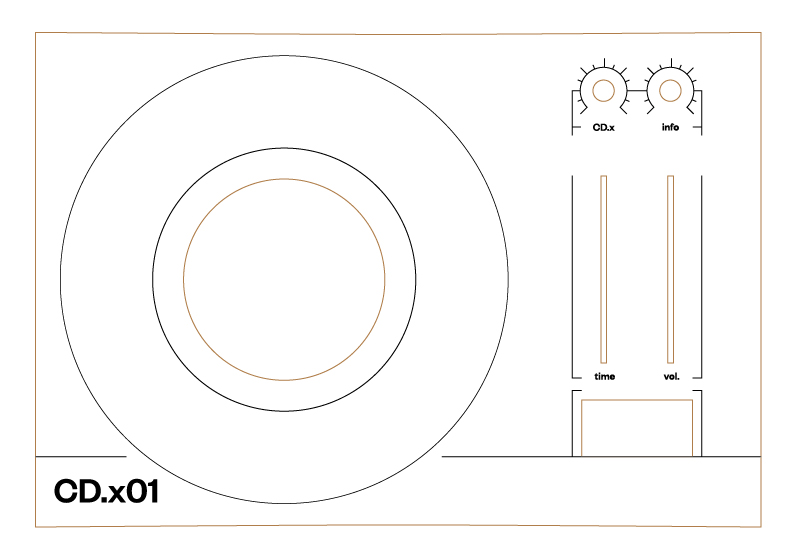

# Documentation

This project rethinks the digital access to archive accumulated over the last 5 years of an amateur community that exchanges daily rare or forgotten musical works across social network: Les Chineurs.

## Archives databases

> [Chineurs de House](https://www.facebook.com/groups/chineursdehouse/)
> Chineurs de techno
>


[Post Title]
[Youtube URL]
[Youtube URL name]
[Number or like]
[Post Date]

 ```json
  {
      "postComment": "Je pose ça là. Enjoy 👌!",
      "youtubeID": "zw42bxJqAwQ",
      "urlName": "Stussko - All night long",
      "postReact": "52",
      "postDate": {
            "day": "05",
            "month": "12",
            "year": "2019",
            "hour": "10"
                  }
  }
 ```

When scrapping process is done, a Json file is created and downloaded.

Actual Problem : Comment ne pas enregistrer les post qui ne contient pas les 4 types d'informations souhaité ? 


## Online platform


2. Une the platform to explore and listen the heritage of this living social digging communities 
-> indew.html

[Chineurs de Rap]
[Chineurs de House] 
[Chineurs de Techno]
[Chineurs des Origines]
[Ramen Break]

## Ressources

 ``` javascript
 var s = "Mise en valeur de la syntaxe JavaScript";
 alert(s);
 ```


## CD

### Bill of material

#### Front panel


2. Une the platform to explore and listen the heritage of this living social digging communities 
-> indew.html

[Chineurs de Rap]
[Chineurs de House] 
[Chineurs de Techno]
[Chineurs des Origines]
[Ramen Break]
